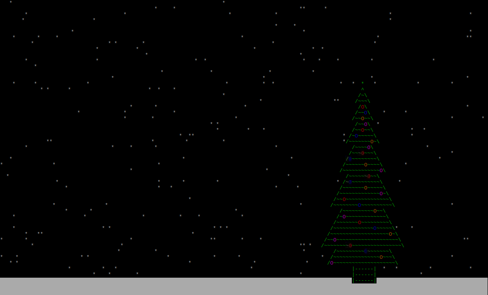

# TNewYearTree
Terminal New Year Tree

[Video](https://youtu.be/-YSzydo17Ak "youtube.com")

Linux:
1. Instanll ncurses ( sudo apt-get install ncurses-dev);
2. Open the terminal in the project folder;
3. Run in the terminal: qmake TNewYearTree.pro;
4. Run in the terminal: make;
5. Run applications ( ./bin/TNewYearTree).